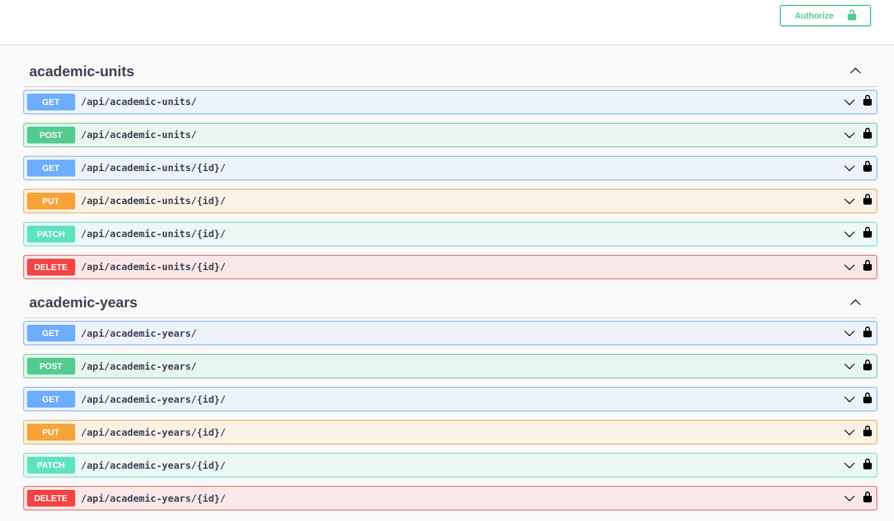
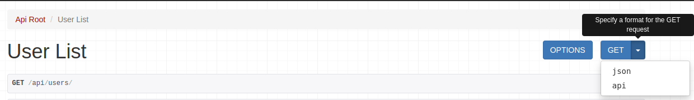
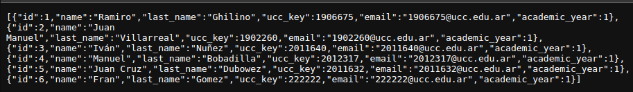
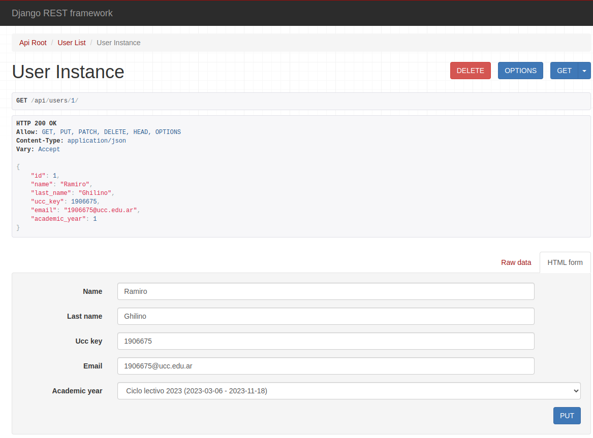

# Proyecto Final: Turnero TAIE

- Alumnos:
    - Ghilino, Ramiro
    - Villarreal, Juan Manuel

- Profesores:
    - Porrini, Federico Eduardo 
    - Carreño, Ignacio Luciano 

## Instalación 🔧

Luego de clonar el repositorio, abrir el proyecto en el IDE de preferencia y, con pip instalado en el equipo, correr el comando `pip install -r requirements.txt` en una consola ubicada a la altura del proyecto.

**Nota**: Por motivos de seguridad, en este proyecto, en el archivo /TutoriaAPI/settings.py se encuentra la variable SECRET_KEY la cual fue remplazada por una variable .env, para poder crear tu propia Secret_Key por favor referirse a [este artículo ](https://codinggear.blog/django-generate-secret-key/)

___
## Configuración ⚙️

Como se puede ver, dentro de `setting.py` se utilizan algunas variables de entorno, por lo cual, tu archivo .env debería verse así:

```
SECRET_KEY=[secret_key]

DB_NAME=[nombre_de_la_bd_en_mysql]
DB_USER= [nombre_usuario_para_conectarse]
DB_PASSWORD= [contraseña_usuario]
DB_HOST= [URL_de_la_BD]
DB_PORT= [puerto_de_la_bd]
```
___
### **NOTA: si se desea utilizar SQLite no es necesario leer este apartado y puede dirigirse directamente a [Iniciando el servidor Django](#Iniciando-el-servidor-Django)**
___

**Aclaraciones en caso de usar un docker container de MySQL**

 El comando mas sencillo para levantar un docker container es el siguiente:
```
  docker run -d -p [DB_PORT]:3306 --name [nombre_container] -e MYSQL_ROOT_PASSWORD=[DB_PASSWORD] mysql 
```

Donde: 
- DB_PORT es el puerto que queremos que se use en nuestra computadora (generalmente 3306)
- DB_PASSWORD es la contraseña que colocamos en el .env SOLO si decidimos conectarnos como DB_USER = root
- Para obtener el valor DB_HOST es necesario utilizar el comando `docker inspect [nombre_container] ` y buscar las dirección IP que generalmente es 172.17.0.x


**NOTA:** el comando para crear el contenedor MySQL no establece ningún volumen para el mismo por lo cual si el contenedor se detiene la información se perderá. Si se quiere destinar un volumen para la permanencia de datos es necesario hacer los siguientes pasos:

- Crear uno con el comando `docker volume create [nombre_volumen] `

- Sumar la flag `-v [nombre_volumen]:[path_destino]` a nuestro comando anterior entre `-e MYSQL_ROOT_PASSWORD=[DB_PASSWORD]` y `mysql`.

El comando final que incluye un volumen sería:
```
docker run -d -p [DB_PORT]:3306 --name [nombre_container] -e MYSQL_ROOT_PASSWORD=[DB_PASSWORD] -v [nombre_volumen]:/var/lib/mysql mysql 
```
`/var/lib/mysql` Es el directorio por defecto donde docker guarda datos referidos a la imagen de MySQL, pero podría ser otro de tu agrado.

Con estos comandos creamos un container de mysql, pero aún se encuentra vacío y nosotros indicamos en el archivo `.env` un DB_NAME, para crearlo tenemos 2 opciones:

- Con el container corriendo (usar `docker ps` para saber si el container esta corriendo), debemos usar los siguientes comandos:
  - `docker exec -it [nombre_container] mysql -p` lo cual nos permite entrar a la consola del container como usuario root.
  - Nos pedirá la contraseña, la cual es la utilizada en el campo `[DB_PASSWORD]` en el comando docker
  - Deberíamos ver que ahora la consola indica `mysql>` y a continuación escribimos el comando `create database [DB_NAME];`
  - Este paso es opcional, si queremos asegurarnos de que la database fue creada escribimos el comando `show databases;`
  - Ahora utilizamos `exit` para salir de la consola del container
- La segunda opción es utilizar la herramienta visual de nuestra preferencia (MySQL Workbench, DBeaver, etc), realizar la conexión con localhost, puerto `DB_PORT`, usuario root y contraseña `DB_PASSWORD`.

___ 

## Cargando Datos

Si queremos agregar datos para probar la API, existen dentro de la carpeta `fixture` en la app abm_usuario_app archivos .JSON que nos permiten insertar datos en las diferentes tablas.

Para utilizar estos fixtures usamos el comando `python manage.py loaddata [nombre_archivo.json] `

En el caso de no haber asigando un volumen al container de MySQL, antes de parar el contenedor podemos utilizar el comando `python manage.py dumpdata > [nombre_archivo.json] ` y así generar un archivo válido para el comando `loaddata`.
___
## Iniciando el servidor Django

Si es la primera vez que vamos a utilizar el container de MySQL, o si no le asignamos un volumen y detuvimos el contenedor, tenemos que crear las tablas que necesita el servico, esto se logra con el comando `python3 manage.py migrate`

Una vez completada la instalación y configuración, para levantar la aplicación solo debemos ubicarnos a la altura del archivo `manage.py`y ejectura el siguiente comando en consola: `python manage.py runserver [numero_de_puerto]`. Si no se indica un número de puerto, django por defecto levantará el servidor en el puerto `8000`

Nos dirijimos a [localhost:[puerto]/api/](http://localhost:8000/api/)

¡Listo, ya estamos en nuestro servidor Django!

___
## Uso 

Una vez que iniciamos el servidor y nos dirijimos a la URL podemos empezar a utilizar la API REST
___
### Haciendo una Query

Si visitamos [localhost:[puerto]/schema/docs/](http://localhost:8000/api/schema/docs) podemos encontrar la documentación de la API con el estándar OpenAPI.



En esta página podemos encontrar todos los endpoints de la API, aprender sus requisitos y sus respuestas.

Para hacer la primera consulta a nuestra API (asumiendo que ya tenemos datos cargados), elegimos una de función GET del modelo que contenga [datos](#cargando-datos).

En el caso de este tutorial utilizaremos `http://localhost:8000/api/users/`

Una vez que seleccionamos la función GET tenemos 3 opciones:
 - Utilizarla directamente desde nuestro navegador (ingresando `http://localhost:8000/api/users/`)
 - Utilizar programas de 3ros como [Postman](https://www.postman.com/) o extensiones de VS Code como [Thunder Client](https://www.thunderclient.com/)
 - Utilizarlo haciendo peticiones desde nuestro frontend.

 **NOTA:** si elegimos la 3ra opción, podemos ir a `http://localhost:8000/api/schema`, donde un archivo `.yaml` se descargará y a partir de este archivo un codegen OpenAPI del lenguaje utilizado nuestro front nos generará el código necesario para mapear las respuestas de la API.

Si nos dirgimos `http://localhost:8000/api/users/` podemos ver que tenemos una página como esta:


**NOTA:** esta vista es una renderización especial que se brinda en la API para que resulte más fácil a los nuevos usuarios familiarizarse con la API, si se desea una respuesta en formato JSON como con las otras opciones debemos dirigirnos a la flecha al lado de `GET` y elegir json:



Y la nueva vista será:



La consulta anterior sería un GET all de los usuarios, si queremos un usuario particular, debemos utilizar (como se indica en la docmentación) `http://localhost:8000/api/users/{id}`, donde id es el número de id del usuario que queremos conocer. 

Por ejemplo para `http://localhost:8000/api/users/1` obtendremos:



Esta nueva consulta es un GET para un usuario particular y gracias a la renderización podemos acceder a todos los métodos CRUD del modelo User.